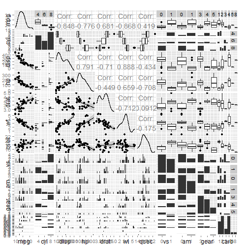

# Exploring the relationships between a set of variables and miles per gallon for a collection of cars

## Synopsis

Looking at a data set of a collection of cars, we are interested in exploring the relationship between a set of variables and miles per gallon (MPG). We are particularly interested in the following two questions:

* Is an automatic or manual transmission better for MPG
* Quantify the MPG difference between automatic and manual transmissions

## Exploring the data

Let's load dataset and look at the data primary features:


```r
library(datasets)
data(mtcars)

dim(mtcars)
```

```
## [1] 32 11
```

```r
head(mtcars)
```

```
##                    mpg cyl disp  hp drat    wt  qsec vs am gear carb
## Mazda RX4         21.0   6  160 110 3.90 2.620 16.46  0  1    4    4
## Mazda RX4 Wag     21.0   6  160 110 3.90 2.875 17.02  0  1    4    4
## Datsun 710        22.8   4  108  93 3.85 2.320 18.61  1  1    4    1
## Hornet 4 Drive    21.4   6  258 110 3.08 3.215 19.44  1  0    3    1
## Hornet Sportabout 18.7   8  360 175 3.15 3.440 17.02  0  0    3    2
## Valiant           18.1   6  225 105 2.76 3.460 20.22  1  0    3    1
```

```r
summary(mtcars)
```

```
##       mpg             cyl             disp             hp       
##  Min.   :10.40   Min.   :4.000   Min.   : 71.1   Min.   : 52.0  
##  1st Qu.:15.43   1st Qu.:4.000   1st Qu.:120.8   1st Qu.: 96.5  
##  Median :19.20   Median :6.000   Median :196.3   Median :123.0  
##  Mean   :20.09   Mean   :6.188   Mean   :230.7   Mean   :146.7  
##  3rd Qu.:22.80   3rd Qu.:8.000   3rd Qu.:326.0   3rd Qu.:180.0  
##  Max.   :33.90   Max.   :8.000   Max.   :472.0   Max.   :335.0  
##       drat             wt             qsec             vs        
##  Min.   :2.760   Min.   :1.513   Min.   :14.50   Min.   :0.0000  
##  1st Qu.:3.080   1st Qu.:2.581   1st Qu.:16.89   1st Qu.:0.0000  
##  Median :3.695   Median :3.325   Median :17.71   Median :0.0000  
##  Mean   :3.597   Mean   :3.217   Mean   :17.85   Mean   :0.4375  
##  3rd Qu.:3.920   3rd Qu.:3.610   3rd Qu.:18.90   3rd Qu.:1.0000  
##  Max.   :4.930   Max.   :5.424   Max.   :22.90   Max.   :1.0000  
##        am              gear            carb      
##  Min.   :0.0000   Min.   :3.000   Min.   :1.000  
##  1st Qu.:0.0000   1st Qu.:3.000   1st Qu.:2.000  
##  Median :0.0000   Median :4.000   Median :2.000  
##  Mean   :0.4062   Mean   :3.688   Mean   :2.812  
##  3rd Qu.:1.0000   3rd Qu.:4.000   3rd Qu.:4.000  
##  Max.   :1.0000   Max.   :5.000   Max.   :8.000
```

As we can see, there are bunch of variables that should be factors rather than numeric. Let's transofrm them appropriately:


```r
mtcars$cyl = factor(mtcars$cyl)
mtcars$vs = factor(mtcars$vs)
mtcars$am = factor(mtcars$am)
mtcars$gear = factor(mtcars$gear)
mtcars$carb = factor(mtcars$carb)

summary(mtcars)
```

```
##       mpg        cyl         disp             hp             drat      
##  Min.   :10.40   4:11   Min.   : 71.1   Min.   : 52.0   Min.   :2.760  
##  1st Qu.:15.43   6: 7   1st Qu.:120.8   1st Qu.: 96.5   1st Qu.:3.080  
##  Median :19.20   8:14   Median :196.3   Median :123.0   Median :3.695  
##  Mean   :20.09          Mean   :230.7   Mean   :146.7   Mean   :3.597  
##  3rd Qu.:22.80          3rd Qu.:326.0   3rd Qu.:180.0   3rd Qu.:3.920  
##  Max.   :33.90          Max.   :472.0   Max.   :335.0   Max.   :4.930  
##        wt             qsec       vs     am     gear   carb  
##  Min.   :1.513   Min.   :14.50   0:18   0:19   3:15   1: 7  
##  1st Qu.:2.581   1st Qu.:16.89   1:14   1:13   4:12   2:10  
##  Median :3.325   Median :17.71                 5: 5   3: 3  
##  Mean   :3.217   Mean   :17.85                        4:10  
##  3rd Qu.:3.610   3rd Qu.:18.90                        6: 1  
##  Max.   :5.424   Max.   :22.90                        8: 1
```

Let's look at relationships between different variables:


```r
plot(mtcars)
```

 

## Building data model

## Summary
